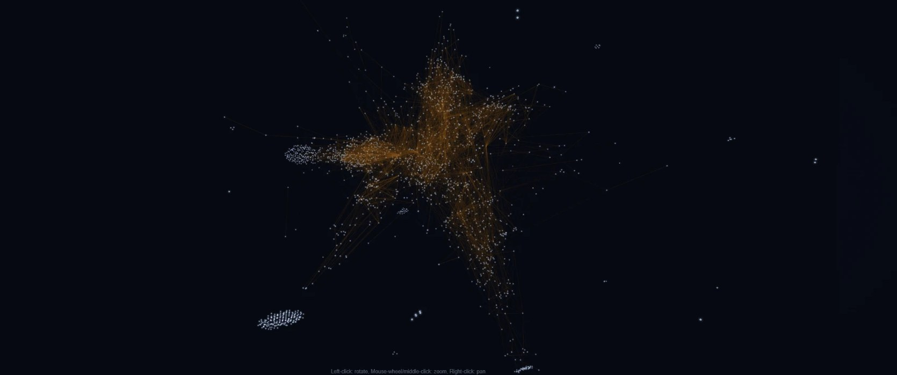

# Murat Süer

**Founder, Heretic OS — the layer an AI agent runs on.**

Not a bigger brain. The brain stem underneath it: a memory that hands back the original word for word, a live map of the codebase the agent thinks with, security inside the loop, and process gates a stage cannot close without.

12 years of industrial engineering in regulated environments — oil & gas, FMCG, large-scale construction — where an unlogged decision is a finding and a wrong one is an incident. That is the half this field is short of. Chemnitz, Germany.

I ship systems with tests, evals and audit trails. Not demos.

---

## Systems

### 🧠 [Heretic OS](https://github.com/murat-suer/heretic-os) · agent operating system

Memory folds by address and returns the original byte for byte — 100% recovery across 1,008 live folds, zero loss and zero false alarms. Against the field's best-funded open memory system on LoCoMo: **0.685 against 0.438** under a strict independent judge, on **10.4× fewer** write-time model calls (656 against 6,836, counted on the same corpus). Runs in the cloud, on a laptop, or with the network cable cut.

`172,997 lines of product code` · `549,394 lines of tests` · `13,197 tests passing` · `2 inventions filed with the USPTO`

Closed-source commercial system — architecture tour in the repo.

---

### 🕸 [Code Intelligence](https://github.com/murat-suer/code-intelligence) · codebase → knowledge graph

An 11-pass Tree-sitter pipeline that turns a repository into something an agent can query: who calls whom, where a value travels, which test covers which line, and what breaks if you touch this. Full depth in ~15 languages, call graph across ~29, symbol inventory across 39.

**95.8% call-graph precision against PyCG's 96.2%** — on PyCG's own public 119-case suite, both engines run by us under the same scorer, rather than quoted from either paper. One false positive in 60 edges; the reference tool had two.

`153,923 entities` · `920,877 edges` · one pass over a 2,148-file tree

---

### ⚙️ [PdM Platform](https://github.com/murat-suer/pdm-predictive-maintenance) · industrial predictive maintenance

Physics-based plant simulation (Weibull/IEEE 493, ISO 281, Arrhenius, TEMA) into explainable ML — IsolationForest + SHAP detection, XGBoost RUL with split-conformal intervals — into a risk-adjusted decision engine with ISA-18.2 alarm management. Approved decisions act back on the plant, and every repair is booked against its own run-to-failure counterfactual.

Authority-ranked human oversight per EU AI Act Art. 14: two of four options need a Production Manager or a Plant Manager, and if nobody answers inside the response window the recommendation applies under its own named identity — never under a human's.

`1,300+ tests` · `78% coverage` · **[live demo](https://pdm.muratsuer.eu)** — open at any hour, audit trail populated

---

### 🚗 [Auction Risk Engine](https://github.com/murat-suer/automotive-auction-risk-engine) · imbalanced-data ML

Lemon detection with a leakage-safe pipeline, plus an opportunity layer the brief did not ask for: OOF-calibrated mining of undervalued low-risk vehicles with Wilson intervals.

`F1 0.34 → 0.42` · `92–98% holdout on the opportunity layer`

---

## Research

A public series, each article published with its method and an evidence table beside it — written to survive technical and legal review before it goes up.

- [Telemetry is not evidence](https://heretics.dev/research/03-telemetry-is-not-evidence/article.html) — a log a system writes about itself is testimony, not proof
- [A tamper-evident, append-only audit trail for autonomous agents](https://heretics.dev/research/04-tamper-evident-agent-audit-trail/article.html) — a defensive publication
- [Integrity proof and erasure proof in the same ledger](https://heretics.dev/research/05-integrity-and-erasure-in-one-ledger/article.html) — the GDPR pair, solved once
- [Wired, suspect, unwired](https://heretics.dev/research/06-three-state-wiring-classification/article.html) — code that exists, passes its tests, and is connected to nothing

Full series: **[heretics.dev/research](https://heretics.dev/research/)**

---

## Stack

`Python` `FastAPI` `scikit-learn` `XGBoost` `PyTorch` `SQLite` `TimescaleDB` `Redis Streams` `Docker` `MCP` `Tree-sitter` `React/TypeScript`

## Contact

🌐 [heretics.dev](https://heretics.dev) · 👤 [muratsuer.eu](https://muratsuer.eu) · 💼 [LinkedIn](https://linkedin.com/in/murat-suer) · ✉️ murat@muratsuer.eu
